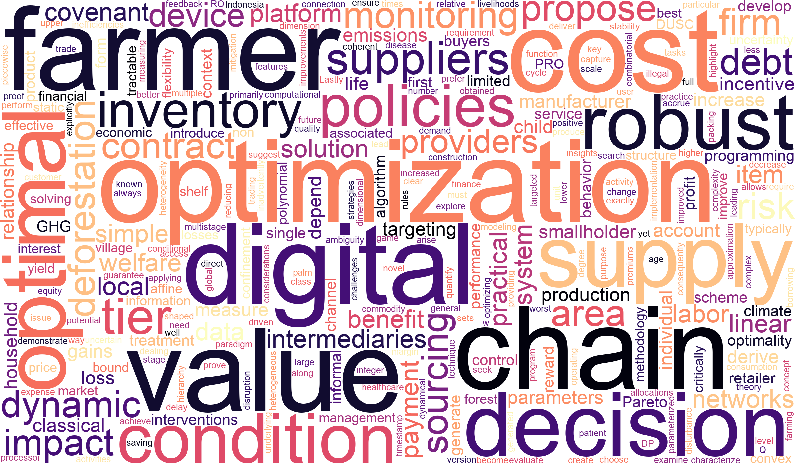

---
# Keep the homepage title empty to use the site title
title: ""
type: landing

# NOTE: page-level `design.spacing` is NOT read by this theme -- parse_block_v3 only
# honours the per-BLOCK `design.spacing.padding`. Section spacing is controlled by
# `--site-section-gap` in assets/css/custom.css.

sections:
  # ========== HERO / ABOUT ME / CONTACT ==========
  # Affiliations, Contact and Faculty Assistant live inside `content.text` rather than
  # in a separate `markdown` block. resume-biography-3 is a 4/8 two-column grid at md+,
  # so its bio column starts ~110px right of where a standard markdown block (which is
  # `max-w-prose mx-auto`, i.e. page-centred) begins. Two blocks therefore had two
  # different left edges and the lower one read as shifted left. Keeping this content in
  # the hero's own column makes the whole page share one text edge.
  #
  # `content.text` overrides the author profile body, so Home shows jemdoc's
  # first-person "About Me" paragraph while /bio/ shows the third-person bio.
  #
  # The   tags in Contact / Faculty Assistant are required: Markdown folds
  # consecutive lines into one paragraph, so jemdoc's per-line `\n` breaks were being
  # lost and the address ran together on a single line.
  - block: resume-biography-3
    content:
      username: admin
      text: |-
        I am a Professor in the [Operations, Information, and Technology](https://www.gsb.stanford.edu/faculty-research/faculty/academic-areas/operations-information-technology)
        group at the [Stanford Graduate School of Business](https://www.gsb.stanford.edu).
        My research and teaching focus on how analytics, optimization, and AI can help
        individuals and organizations make better decisions under uncertainty. I am
        particularly interested in the responsible use of these tools in complex operational
        settings, including global supply chains, finance, healthcare, and public policy.

        <h4 class="hm-head">Affiliations</h4>

        - [Woods Institute for the Environment](https://woods.stanford.edu/)
        - [King Center on Global Development](https://kingcenter.stanford.edu/) — Peiros Family Faculty Fellow, 2026–2028
        - [Institute for Human-Centered Artificial Intelligence](https://hai.stanford.edu/)
        - [Institute for Computational and Mathematical Engineering](https://icme.stanford.edu/)

        

        

        <h4 class="hm-head">Contact</h4>

        655 Knight Way, Stanford, CA 94305 
        [Knight Management Center, Faculty Building East #369](http://maps.stanford.edu/ada/building-ada.cfm?FACIL_ID=08-050A) 
        Tel: +1 (650) 724-6642 
        Email: <daniancu@stanford.edu>

        

        

        <h4 class="hm-head">Faculty Assistant</h4>

        Traci McCool 
        Office: Knight Management Center, Botha Chan (BC) 247 
        Tel: +1 (650) 724-5308 
        Email: <tmccool@stanford.edu>

        

        

      headings:
        about: "About Me"   # "" renders the i18n default "Professional Summary" (G6)
        education: ""
        interests: ""
    design:
      avatar:
        size: medium
        shape: circle

  # ========== WORD CLOUD ==========
  # Moved here from /research/, where it competed with the "What I work on" panels --
  # both answered the same question, and the panels do it better in text. On the home
  # page it is a welcome visual and competes with nothing.
  # Wrapped in .hm-wordcloud, which mirrors the hero's 12-column grid so the image
  # lands in the same right-hand column as About Me and Interests above it, rather
  # than centred on the full page width. See assets/css/custom.css.
  - block: markdown
    content:
      title: ""
      text: |-
        

        

        

        *Built from selected abstracts of my papers.*

        

        

    design:
      columns: "1"
---
